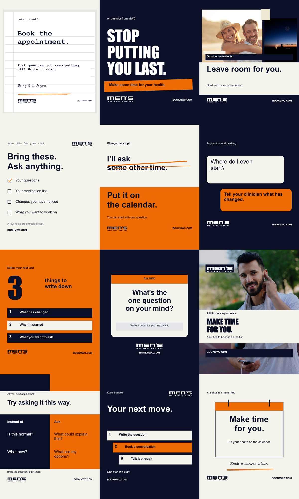

# MWC Instagram Studio

An offline Instagram static-image generator for Men's Wellness Centers. Open **index.html** in Chrome or Edge to use it; no installation, API key, or account is needed.



## Create a post

Choose a template, edit its copy, select supplied photography or upload your own, then export a PNG. Each template keeps separate edits during the session. **Save project** downloads all 17 drafts as JSON, including uploaded photos; **Open project** restores them. Edits are not automatically saved.

**View collection** shows the collection in portrait format and exports a 3240 × 5400 PNG. Older 12-template project files are accepted and rendered using the current layouts. Three-template project files are not supported.

## September reference update

The app opens with five new editable layouts: Clinic / cream fade, Photo / navy fade, Cream / bold frame, Navy / headline focus, and Clinic / photo window. Choose **All 17 layouts** to see the original templates too.

**References** opens three reference boards from the supplied September 17 output folder. Each offers a starting layout. Reference images are inspiration with baked-in copy; editing happens in the live canvas, not in the reference bitmap.

Four supplied consultation, clinic and fitness photos, the vector MWC wordmarks, and Oswald are bundled locally. No image generation service is used. Edit the callout to change the consultation button independently from the website. All assets are embedded in the built HTML, which works offline.

Sources: `MWC-18-60-Brand-Photos/renderer/assets`, its contact sheet, and `mwc-instagram/01-variant-1.png` / `02-variant-1.png` from the supplied output directory. The production package describes the latter references as AI-generated reinterpretations of supplied people. They are displayed only as reference artwork.

## Templates

Note to self, Marker poster, Photo contact sheet, Screenshot checklist, Cross-out / rewrite, Message exchange, Big number / list, Question sticker, Photo caption strip, Side-by-side, Step stack, and Calendar reminder.

## Formats and safe zones

| Format | Export size | Clear sides | Clear top | Clear bottom |
| --- | --- | --- | --- | --- |
| Portrait 4:5 | 1080 × 1350 | 80 px | 175 px | 175 px |
| Square 1:1 | 1080 × 1080 | 80 px | 80 px | 80 px |
| Story 9:16 | 1080 × 1920 | 80 px | 270 px | 390 px |

These conservative studio margins apply to essential text and logos. Portrait copy also stays inside a centered square crop. The renderer checks actual glyph and logo bounds, reserves space for disclosures, and prevents export when copy is too small or a list has too many items. Safe-zone guides are preview overlays and are never exported.

Backgrounds and photos can extend beyond the guides. Review uploaded photo crops. Platform overlays vary by placement; the Story preset is not a Reels preset.

## Develop

Python 3 builds the single-file app without third-party packages:

```sh
python scripts/build.py
```

Edit `src/studio.html` for the interface and `src/studio.js` for templates and rendering, then rebuild. Required supplied images live in `assets/`. The generated `index.html` is committed so the app can be used immediately.

To run browser checks with Node.js and Playwright:

```sh
npm install
npx playwright install chromium
npm test
```

The checks cover 153 content-bound cases across 17 templates and 3 formats, type sizes, disclosures, guide-free PNG exports, project save/open, list limits, uploads, grid export, and mobile width. Screenshots and test files are saved under ignored `test-results/`.

The five new layouts embed the supplied Oswald font. Original layouts use local system fonts, so their rendering can vary slightly across devices.

## Media and content

**No AI-generated people without a supplied reference.** This application does not generate people or images. Included photos come from the supplied MWC asset pack; their original provenance has not been independently verified. The contact-sheet layout includes a supplied evening-sky image alongside the selected photo.

The supplied Hone Health and PeterMD grid captures informed format variety. The [instagram-skills repository](https://github.com/sergebulaev/instagram-skills) informed short, single-idea copy and natural wording; it is not an installed dependency. Competitor captures and the superseded financing design are not included.

This app exports images. It does not publish to Instagram or send images to an external service.

## Stock photo library

Campaign photography includes all 13 unique files from the supplied uploaded-stock collection (two already appear under clinic photos), plus the existing campaign and clinic images: 23 choices total. Search by name or stock ID. Duplicate originals are omitted. Newly imported stock photos are bundled at up to 2160 pixels on the longest side for practical offline loading; source paths are recorded in assets/stock/manifest.json. Stock selection, search, export and project round-trip checks are in tests/stock.cjs.


## Compliance preflight

Use **Compliance check** to screen the current post's rendered editable text and studio layout warnings. The local checker identifies contextual cues for manual review, with evidence, proposed corrections, official policy links, and a downloadable text report. It does not analyze images, perform OCR, fetch destinations, verify targeting or rights, or certify Meta approval. Current policy retrieval on September 20, 2026 was rate limited (HTTP 429); all policy findings are provisional. Supplied skill references are preserved in docs/meta-ad-creative-compliance. Run node tests/compliance.cjs for the screening and UI regression cases.
